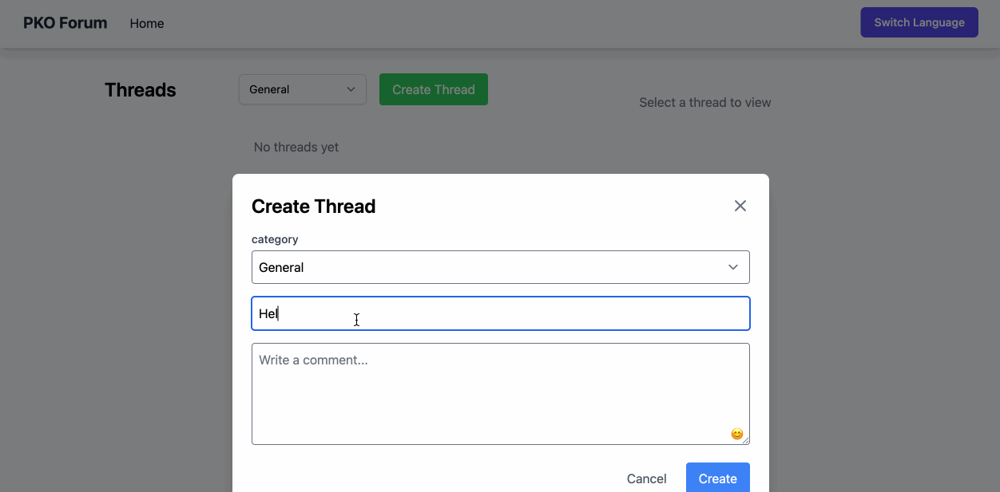

<div align="center">


A modern, multilingual discussion platform built with Go and SvelteKit.

[](https://go.dev)
[](https://kit.svelte.dev)
[](LICENSE)

[Report Bug](issues/new) · [Request Feature](issues/new)

</div>

## 🌟 Features

- 🌐 **Multilingual Support**: Seamless switching between English and Russian
- 💬 **Rich Discussions**: Create threads and comments with image support
- 🤖 **AI-Powered Translations**: Automatic content translation using Deepseek AI
- 🎨 **Modern UI**: Beautiful, responsive interface built with TailwindCSS
- 📱 **Mobile-First**: Fully responsive design that works on all devices
- 🔒 **Secure**: Built with security best practices

## 🎥 Demo



## 🚀 Quick Start

### Prerequisites

- Docker and Docker Compose
- Deepseek API Key (for translations)

### Installation

1. Clone the repository:
```bash
git clone https://github.com/yourusername/pkoforum.git
cd pkoforum
```

2. Create a `.env` file:
```bash
DEEPSEEK_API_KEY=your_api_key_here
DEEPSEEK_URL=https://api.deepseek.com  # or your custom URL
```

3. Start the application:
```bash
docker-compose up --build
```

4. Open your browser and navigate to `http://localhost`

## 🏗️ Architecture

PKO Forum uses a modern tech stack:

- **Backend**: Go 1.24.2 with SQLite database
- **Frontend**: SvelteKit with TailwindCSS
- **Container**: Docker with multi-stage builds
- **AI Integration**: Deepseek API for translations
- **Storage**: SQLite for data, file system for uploads

## 📁 Project Structure

```
pkoforum/
├── src/               # Frontend SvelteKit application
├── internal/          # Backend Go packages
│   ├── api/          # REST API handlers
│   └── config/       # Configuration management
├── db/               # Database migrations and queries
├── docs/             # Documentation
├── static/           # Static assets
└── docker/           # Docker configuration
```

## 🛠️ Development

### Backend Development

```bash
# Run backend in development mode
go run main.go
```

### Frontend Development

```bash
# Install dependencies
npm install

# Start development server
npm run dev
```

## 🔧 Configuration

The application can be configured using environment variables:

| Variable | Description | Default |
|----------|-------------|---------|
| PORT | Server port | 8080 |
| DEEPSEEK_API_KEY | Deepseek API key | Required |
| DEEPSEEK_URL | Deepseek API URL | https://api.deepseek.com |
| UPLOADS_PATH | Path for uploaded files | /app/static/uploads |

## 🤝 Contributing

We welcome contributions! Please see our [Contributing Guide](CONTRIBUTING.md) for details.

1. Fork the repository
2. Create your feature branch (`git checkout -b feature/AmazingFeature`)
3. Commit your changes (`git commit -m 'Add some AmazingFeature'`)
4. Push to the branch (`git push origin feature/AmazingFeature`)
5. Open a Pull Request

## 📝 License

This project is licensed under the MIT License - see the [LICENSE](LICENSE) file for details.

## 🙏 Acknowledgments

- [Go](https://go.dev) - Backend language
- [SvelteKit](https://kit.svelte.dev) - Frontend framework
- [TailwindCSS](https://tailwindcss.com) - Styling
- [Deepseek](https://deepseek.com) - AI translations

## 📞 Support

- Create a [GitHub Issue](issues/new)
- Email: nyarumilian@gmail.com

## 🔮 Roadmap

- [ ] User authentication and profiles
- [ ] Advanced search functionality
- [ ] API documentation with Swagger
- [ ] Real-time notifications
- [ ] Mobile applications 